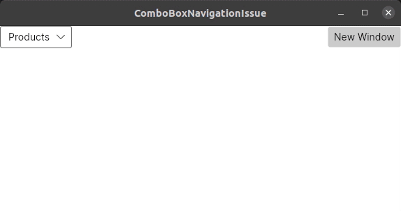

# ComboBox navigation issue sample

This is a sample repository for an issue I am having.  

There is a `ComboBox` with a number of `ComboBoxItem` instances  
which are bound to different `ViewModel` properties of `MainWindowViewModel`.
  
As a result, selecting different items in the `ComboBox` switches views   
but this only seems to work if you actually **click** on the `ComboBox` with the mouse.  

When the `Window` is activated the `Content` should be `ProductsView` (red)  
but it's empty until you click on the `ComboBox`. 

Selecting different items by using the keyboard or in code behind have no effect either until the `ComboBox` has been clicked at least once.

You can click the `New Window` button to try this multiple times.

## Demo video

## Alternative Implementation

For those who are trying to do something similar  
and cannot wait for this issue to be fixed, the `feature/workaround` branch  
contains an alternative solution. It adds some complexity but it works.
